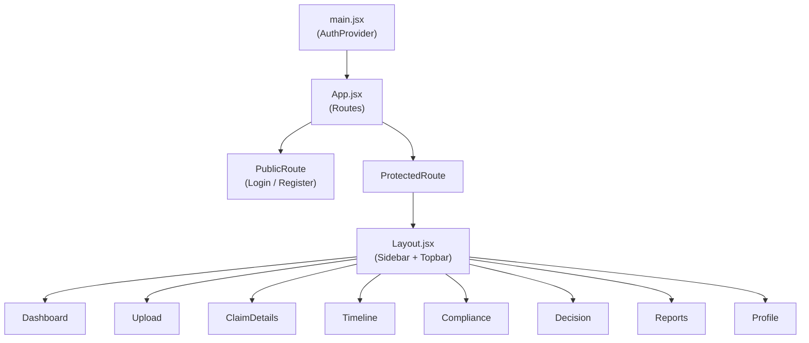

# Claim VerifiAI — Project Documentation

> NHA Hackathon Frontend | AI-Powered Healthcare Claim Validation Platform

---

## Table of Contents

1. [Project Overview](#1-project-overview)
2. [Tech Stack](#2-tech-stack)
3. [Project Structure](#3-project-structure)
4. [SaaS Architecture & Data Flow](#4-saas-architecture--data-flow)
5. [Routing & Protection](#5-routing--protection)
6. [Pages & API Integration](#6-pages--api-integration)
7. [Components](#7-components)
8. [Styling System](#8-styling-system)
9. [Dark Mode](#9-dark-mode)
10. [Development & Troubleshooting](#10-development--troubleshooting)

---

## 1. Project Overview

**Claim VerifiAI** is a production-ready React frontend web application built for the National Health Authority (NHA) Hackathon. It is a full-fledged SaaS platform that integrates with a Django backend to automate the extraction, validation, and processing of medical claims.

### Core Value Proposition

| Feature | Description |
|---|---|
| **OCR + AI Extraction** | Upload documents (drag-and-drop) and parse patient data |
| **STG Rule Validation** | Live compliance scoring against Standard Treatment Guidelines |
| **Timeline Intelligence** | API-driven reconstruction of the patient treatment journey |
| **Fraud / Risk Detection** | Real-time backend dashboard risk alerts |
| **AI Decision Engine** | Live approval/rejection verdicts with fetched evidence/reasons |
| **PDF Report Export** | Dynamic PDF generation injected with real backend claim data |

---

## 2. Tech Stack

| Layer | Technology | Version |
|---|---|---|
| UI Framework | React | ^19.2.5 |
| Build Tool | Vite | ^8.0.10 |
| Routing | React Router DOM | ^7.14.2 |
| State Management | React Context API | — |
| HTTP Client | Native `fetch` with Interceptors | — |
| Styling | Vanilla CSS (per-page modules) | — |
| PDF Export | jsPDF | ^2.5.1 |

> [!NOTE]
> The frontend is fully integrated with 23 remote API endpoints hosted on Railway. The central API configuration is located in `src/services/api.js`.

---

## 3. Project Structure

```
NHA-Hackathon/
└── nha-claim-frontend/          
    ├── src/
    │   ├── main.jsx             # Entry, wraps App in AuthProvider
    │   ├── App.jsx              # Public/Protected route definitions
    │   ├── context/
    │   │   └── AuthContext.jsx  # Global session state & JWT management
    │   ├── services/
    │   │   ├── api.js           # Fetch wrapper, intercepts 401s, handles base URL
    │   │   ├── authService.js   # Login, Register, Profile, Logout
    │   │   ├── claimsService.js # 11 endpoints (Create, Upload, Timeline, etc.)
    │   │   └── reportsService.js# 8 endpoints (Dashboard, Export, Compliance)
    │   ├── components/
    │   │   ├── Layout.jsx       # App Shell (Sidebar, Topbar, Search, Notifs)
    │   │   └── ProtectedRoute.jsx # Authentication guard wrapper
    │   ├── pages/               # All React views (Login, Upload, Reports, etc.)
    │   └── styles/              # Vanilla CSS stylesheets
```

---

## 4. SaaS Architecture & Data Flow



### Global State Management
The application relies on `AuthContext` to manage the session globally:
- **Initialization:** On boot, the app checks `localStorage` for an `access_token` and queries `/api/auth/profile/` to hydrate the user state.
- **Interceptors:** `api.js` automatically injects `Authorization: Bearer <token>` into all requests. It handles JWT refresh flows implicitly.

### Claim State Propagation
Unlike traditional Redux architectures, the claim flow maintains its state statelessly via **URL Query Parameters**.
When a claim is created on the `Upload` page, the resulting `claim_id` is appended to the URL (`/claim-details?id=123`). Every subsequent page reads this ID from the URL and fetches its specific data slice (e.g., Timeline, Compliance) independently. This allows for direct link sharing and browser refreshing without state loss.

---

## 5. Routing & Protection

Routes are defined in `App.jsx` and separated into two security zones:

| Component Wrapper | Purpose | Routes |
|---|---|---|
| `<PublicRoute>` | Redirects logged-in users away from auth pages to the dashboard | `/`, `/register`, `/forgot-password` |
| `<ProtectedRoute>` | Blocks unauthenticated users, redirects to `/login`, shows verify spinner | `/dashboard`, `/upload`, `/profile`, `/claim-details`, etc. |

---

## 6. Pages & API Integration

All pages now fetch live data. Hardcoded UI states have been replaced with async lifecycle hooks (`useEffect`, `useState`).

### 6.1 Authentication (Login / Register / Forgot Password)
- **APIs:** `POST /api/auth/login/`, `POST /api/auth/register/`
- **Features:** Inline error mapping, loading button states, automatic `AuthContext` hydration upon successful credentials. Forgot Password handles success confirmation UI locally.
- **Payload Specs:** Register sends `{"username", "email", "password"}`.

### 6.2 Dashboard
- **APIs:** `GET /api/reports/dashboard/`, `GET /api/claims/list/`
- **Features:** Uses `Promise.allSettled` to fetch analytics and recent claims concurrently. Handles partial failures gracefully.

### 6.3 Upload
- **APIs:** `POST /api/claims/create/`, `POST /api/claims/upload/<id>/`
- **Features:** Implements a full **Drag & Drop** zone. While the API uploads the document as `FormData`, the UI displays a concurrent, simulated OCR progress animation (Extracting → Parsing → Finalising) to improve perceived performance.

### 6.4 Claim Details & Pipeline (Timeline, Compliance, Decision)
- **Flow:** Each page extracts `?id=` from the URL, triggers its respective `GET` endpoint, and normalizes the backend JSON to handle edge-case naming (e.g., `patient_name` vs `patientName`).

### 6.5 Reports (jsPDF Export)
- **APIs:** `GET /api/reports/claim/<id>/`, `GET /api/reports/history/`
- **Features:** `jsPDF` takes the live JSON data returned from the backend and dynamically draws an auditable PDF locally in the browser.

---

## 7. Components

### 7.1 App Shell (`Layout.jsx`)
- **Live Search:** Debounced (400ms) query to `GET /api/claims/search/?q=`. Displays a dropdown with claim names and styled status pills. Hitting Enter navigates to a search results dashboard.
- **Notifications:** Queries `GET /api/reports/notifications/` on mount to show an unread badge counter. Clicking the bell fetches the list and resets the badge.
- **Profile & Logout:** Displays the user's initial dynamically based on `AuthContext`. The logout button wipes the JWT and forcefully redirects to `/`.

---

## 8. Styling System

The project uses modular vanilla CSS with heavy emphasis on modern SaaS aesthetics.

- **Micro-interactions:** Buttons disable opacity, inputs glow on focus, drop-zones react to file dragging.
- **Progress Tracking:** Uploads feature a dynamic loading bar and step-tracker.
- **Status Pills:** Standardized CSS rules for claim statuses (e.g., `.status-approved { background: #dcfce7; color: #16a34a; }`).

---

## 9. Dark Mode

Dark mode is controlled at the layout level and persisted to `localStorage`.
When active, `document.body.classList.add("dark-mode")` is fired. Every CSS file in the project contains bottom-appended `.dark-mode` overrides that invert colors (e.g., `#f8fafc` to `#1e293b`), soften borders, and adjust font colors.

---

## 10. Development & Troubleshooting

### Local Setup
```bash
npm install
npm run dev
```

### Critical Troubleshooting: Railway DNS Errors
If the frontend returns a **`Failed to fetch`** error, and the browser console reads **`net::ERR_NAME_NOT_RESOLVED`**, this is **not a frontend bug**. 

**Cause:** The base URL inside `src/services/api.js` points to a Railway domain that is currently sleeping, paused, or was regenerated.
**Fix:** 
1. Log into Railway.app
2. Check the active Domain for the backend.
3. Update `BASE_URL` at the top of `src/services/api.js`.
4. *Important:* Ensure you use `http://` or `https://` exactly as provided by the backend, as mismatched protocols will fail the CORS preflight.
